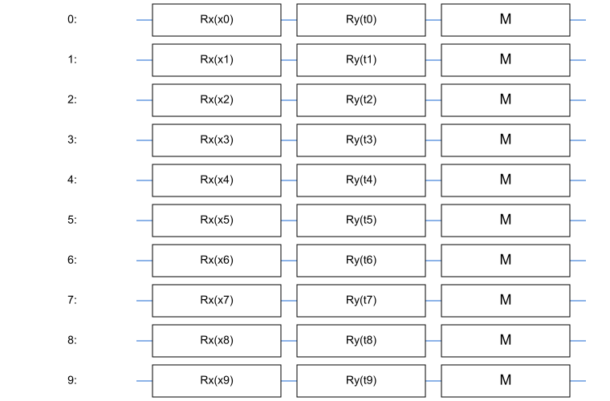
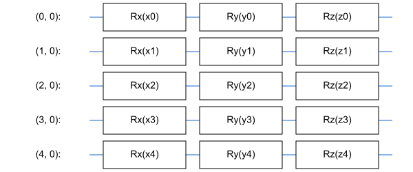
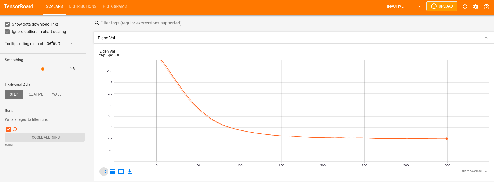
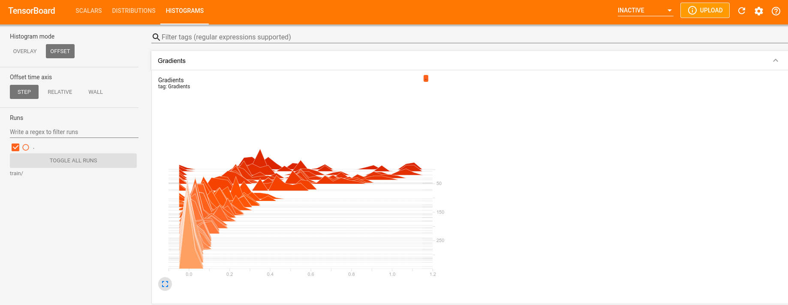

# Знакомство с Tensorflow Quantum и Quantum Machine Learning

На Хабре практически нет информации про квантовое машинное обучение (**Q**uantum **M**achine **L**earning) и в этой статье я постараюсь восполнить этот пробел. Сразу скажу, что промышленных квантовых компьютеров сегодня не существует, все основные разработки в этой области носят теоретический характер, а задачу, которую мы будем разбирать в статье можно решить "по классике" за доли секунд. Но ведь еще 30 лет назад была так называемая ["зима искуственного интеллекта"](https://en.wikipedia.org/wiki/AI_winter), а сегодня нейронные сети буквально окружают нас. Кто знает, может быть вскоре и квантовые компьютеры станут неотъемлемой частью нашей жизни? К тому же область кватовых вычислений, а тем более область **QML** обладает особой притягательностью и таинственностью и, как минимум, стоит ознакомления.


В статье я постарался рассказать об основах **QML** и основном строительном блоке - **V**ariational **Q**uantum **C**ircuit. Большую часть рассказа я постарался сделать практичным, c примерами кода на [*Cirq*](https://github.com/quantumlib/Cirq), а в конце будет реализация одного из базовых алгоритмов **QML** на [*Tensorflow Quantum*](https://www.tensorflow.org/quantum).

## Ведение
Гипотетически, **QML** имеет ряд существенных преимуществ, по сравнению с классическим машинным обучением. **V**ariational **Q**uantum **C**ircuit, или **VQC**, которые можно назвать "аналогом" классических полносвязных слоев в обычных нейронных сетях являются более "выразительными" при этом содержат меньше обучаемых параметров. Ряд квантовых алгоритмов, гипотетически, также дает существенное ускорение по сравнению с обычными аналогами:

| Метод | Ускорение |
| :---- | :-------: |
| Bayesian Inference | $O(\sqrt{N})$ |
| Online Perceptron | $O(\sqrt{N})$ |
| Least Square Fitting | $O(\log(N))$ |
| Classical Boltzman Machine | $O(\sqrt{N})$ |
| Quantum Boltzman Machine | $O(\log(N))$ |
| Quantum PCA | $O(\log(N))$ |
| Quantum SVM | $O(\log(N))$ |
| Quantum RL | $O(\sqrt{N})$ |

Для наиболее полного ознакомления с темой я рекомендую обзор 2017-го года в журнале [Nature](https://www.nature.com/articles/nature23474) или пре-принт той же работы в [arXiv](https://arxiv.org/pdf/1611.09347). Именно из этой работы я взял данную таблицу. В ней указано именно ускорение по сравнению с классическим аналогом. Так, $O(\sqrt{N})$ подразумевает, что квантовый алгоритм квадратично быстрее, чем его классический аналог, а $O(\log(N))$ означает экспоненциальное ускорение.

## Основа **QML**
Как я уже говорил, основной "строительный блок" в **QML** - это **V**ariational **Q**uantum **C**ircuit. Их мы рассмотрим чуть позже, но в целом любая статья или любой новый алгоритм по **QML** будет так, или иначе содержать набор **VQC**. Такие блоки не ялвляются чисто квантовыми схемами и в этом они сильно отличаются, например, от широко известных квантовых алгоритмов Шора или Гровера. В основном **QML** строится по "гибридной" схеме, когда у нас есть параметризованные квантовые схемы, такие как **VQC** и они составляют собой "квантовую" часть. "Классическая" часть обычно отвечает за оптимизацию параметров квантовых схем, например, градиентными методами так, чтобы **VQC**, подобно слоям нейронных сетей "выучивали" нужные нам преобразования входных данных. Именно так построена библиотека *Tensorflow Quantum*, где квантовые "слои" сочетаются с классическими, а обучение происходит как в обычных нейронных сетях.

## Variational Quantum Circuit

**VQC** это простейший элемент систем квантово-классического обучения. В минимальном варианте представляет собой квантовую схему, которая кодирует входным вектором данных $\vec{X}$ квантовое состояние $\left | {\Psi} \right >$ и далее применяет к этому состоянию параметризованные параметрами $\theta$ схемы операторы. Если проводить аналогию с обычными нейронными сетями, то можно представить себе **VQC** как некий "черный ящик", или "слой" который выполняет преобразование входных данных $\vec{X}$ в соответствии с параметрами $\theta$. И тогда, можно сказать, что $\theta$ это аналог "весов" в классических нейронных сетях.


Вот так выглядит простейшая **VQS** где вектор $\vec{X}$ кодируется через вращения кубитов вокруг оси $\mathbf{Z}$, а параметры $\theta$ кодируют вращения вокруг оси $\mathbf{Y}$:

<figure>{width=400px}</figure>

Разберем этот момент подробнее. Мы хотим закодировать входной вектор данных $\vec{X}$ в состояние $\left | \Psi \right >$, по сути своей, выполнить операцию перевода "классических" входных данных в квантовые. Для этого мы берем $N$ кубитов, каждый из которых исходно находится в состоянии $\left | 0 \right >$. Состояние каждого отдельного кубита мы можем представить как точку на поверхности сферы Блоха:

<figure>{width=250px}</figure>

Мы можем "вращать" состояние $\left | \Psi \right >$ нашего кубита применяя специальные одно-кубитные операции, так называемые гейты $\mathbf{X}$, $\mathbf{Y}$, $\mathbf{Z}$, соответствующие поворотам относительно рахных осей сферы Блоха. Мы будем "поворачивать" каждый кубит по оси $\mathbf{Z}$ на угол, определяемый соответствующей компонентой входного вектора $\vec{X}$. 


Получив квантовый входной вектор мы, далее, хотим применить к нему параметризованное преобразование. Для этого мы будем "вращать" соответствующие кубиты уже по другой оси $\mathbf{Y}$ на углы, определяемые параметрами схемы $\theta$. 


Это наиболее простой пример **VQC**, и, как мы увидим дальше, есть более сложные модификации, но суть у них у всех приблизительно одна.

В библиотеке для квантовых вычислений *Cirq* от комапнии Google, которой мы будем активно пользоваться это можно реализовать, например, так:


```python
import cirq
import symbols


qubits = cirq.LineQubit.range(10)
x = sympy.symbols("x0:10")
thetas = sympy.symbols("t0:10")
circuit = cirq.Circuit()

for i in range(10):
    circuit.append(cirq.rx(x[i])(qubits[i]))
    circuit.append(cirq.ry(thetas[i])(qubits[i]))
```

Таким образом мы получаем квантовую ячейку - `circuit`, которая параметризируется классическими параметрами и применяет преобразование к классическому входному вектору. Именно на таких "блоках" и строятся алгоритмы квантово-классического обучения. Мы будем применять преобразования к классическим данным на квантовом компьютере (или симуляторе) измерять выход нашей **VQC** и далее использовать классические градиентные методы для обновления параметров **VQC**.

## Variational Quantum Eigensolver

Основой многих алгоритмов квантового машинного обучения является **H**arrow-**H**asssidim-**L**oloyd [алгоритм](https://journals.aps.org/prl/abstract/10.1103/PhysRevLett.103.150502) (есть пре-принт в [arXiv](https://arxiv.org/pdf/0811.3171)) для поиска решения системы линейных уровнений. Данный алгоритм достаточно сложный и начинать рассказ с него было бы странно. Вместо этого, далее мы посмотрим как устроен другой алгоритм - Variational Quantum Eigensolver - простейший алгоритм поиска минимальных собственных значений эрмитовых матриц.


Почему именно проблема собственных значений? Ответ прост:

* поиск минимальных значений эрмитовых операторов - важная задача физики, именно для нее Р. Фейнман [впервые предложил](https://catonmat.net/ftp/simulating-physics-with-computers-richard-feynman.pdf) модель квантового компьютера
* Variational Quantum Eigensolver является ключевой частью **HHL**-алгоритма
* Сам алгоритм достаточно прост как для понимания, так и для реализации


Опишем задачу формально.

*Дана эрмитова матрица $\mathbf{H}$, или, другими словами, самосопряженный эрмитив оператор. Требуется найти $\lambda_0$ которое является минимальным собственным значением оператора $\hat{\mathbf{H}}$.*


Для решения этой задачи мы воспользуемся так называемой "Вариационной теоремой" ([Variational theorem](
https://en.wikipedia.org/wiki/Variational_method_(quantum_mechanics))), которая для оператора $\hat{\mathbf{H}}$ дает нам следующее:
$$\left < \hat{\mathbf{H}} \right >_{\left | \Psi \right >} = \left < \Psi \right | \hat{\mathbf{H}} \left | \Psi \right > \leq \mathbf{E}_0$$

где $\mathbf{E}_0$ это минимальное собственное значение оператора. По сути тут сказано, что ожидание оператора, измеренного в состоянии $\left | \Psi \right >$ всешда больше, или равно минимальному собственному значению. На этом и строится процесс:

1. Готовим состояние $\left | \Psi(\theta_k) \right >$, параметризованное вектором параметров $\theta_k$
2. Измеряем ожидаемое значение $\lambda_k$ оператора $\hat{\mathbf{H}}$ в состоянии $\left | \Psi(\theta_k) \right >$
3. Оцениваем градиент $g_k = \frac{\partial\lambda}{\partial\theta}$
4. Обновляем вектор $\theta$: $\theta_{k + 1} = \theta_k - \gamma \cdot g_k$

Таким образом наш параметризованный вектор $\left | \Psi(\theta_k) \right >$ каждый раз будет все ближе к первому собтсвенному вектору оператора, а $\lambda_k$ будет (с погрешностью на оценку ожидания) приближаться к минимальному собственному значению $\mathbf{E_0}$.

Надеюсь больше понимания станет, когда мы посмотрим как это выглядит в коде.

## Реализация на *Tensorflow Quantum*
Для начала краткие обозначения импортов:
```python
import tensorflow as tf
import tensorflow-quantum as tfq
```

*Tensorflow Quantum* специальная библиотека, которая позволяет использовать схемы *Cirq* как тензоры *Tensorflow*, а также содержит специальные `tf.keras.Layers` ля квантово-классического обучения. Библиотека совместима со стилем и другими слоями `tf` и позволяет задействовать систему автоматического диффиренцирования Tensorflow. Одним из таких `tfq.layers` мы и воспользуемся - это `tfq.layers.SampledExpectation`. 

Этот слой позволяет оценивать сначала ожидаемое значение оператора в параметризованном состоянии, а потом еще и градиент по параметрам схемы. Сигнатура у него такая:
```python
layer = tfq.layers.SampledExpectation()
res = layer(
    circuit,
    symbol_names,
    symbol_values,
    operators,
    repetitions,
)
```
* `cicuit` - схема, параметризирующая состояние $\left | \Psi \right >$
* `symbol_names` - символы `sympy`, которые параметризируют состояние
* `symbol_values` - значения символов-параметров (обычно `tf.Variable`)
* `operators` - операторы
* `repetitions` - число измерений, по которым оценивается значение оператора

Этот слой явно реализует нам операцию:
$$\left < \Psi(\theta) \right | \hat{\mathbf{Op}} \left | \Psi(\theta) \right >$$
А параметры в формуле связаны с сигнатурой метода `call` следующим образом:

| Формула                | Сигнатура `tfq.layers.SampledExpectation.call`                          |
| :--------------------- | :---------------------------------------------------------------------: |
| $\theta$               | `symbol_values` - значения параметров                                   |
| $\Psi$                 | `circuit` - квантовая схема "готовит" нам состояние                     |
| $\Psi(\theta)$         | `symbol_names` - связь параметры схемы с `symbol_values`                |
| $\hat{\mathbf{Op}}$    | `operators` - оператор, например `cirq.PauliSum`                        |

Параметр `repetition` не имеет прямой связи с математическим формализмом, но именно он показывает нам насколько хорошо мы оцениваем значение оператора.

Но перед началом всего обучения необходимо решить, как именно мы будем параметризовать состояние. В вышеописанных терминах нам надо определить $\left | \Psi(\theta) \right >$, который мы будем передавать в качестве параметра `circuit` в `SampledExpectation`. В данном случае воспользуемся более сложной параметризацией, где на каждый спин у нас будет три параметра: $\theta_x, \theta_y, \theta_z$, вместо одного:

```python
qubits = cirq.GridQubit.rect(dim, 1)
params_x = sympy.symbols(f"x0:{dim}")
params_y = sympy.symbols(f"y0:{dim}")
params_z = sympy.symbols(f"z0:{dim}")
cirquit = cirq.Circuit()

for i in range(dim):
    cirquit.append(cirq.rx(params_x[i])(qubits[i]))
    cirquit.append(cirq.ry(params_y[i])(qubits[i]))
    cirquit.append(cirq.rz(params_z[i])(qubits[i]))
```

Выглядит наша схема так:
<figure></figure>

Для примера, найдем минимальное собственное значение оператора [*Transverse-field Ising*](
https://en.wikipedia.org/wiki/Transverse-field_Ising_model), так называемой "квантовой модели Изинга". Он строится применением [опеаторов Паули](https://en.wikipedia.org/wiki/Pauli_matrices) (в нашем варианте это будут $\sigma^z$ и $\sigma^x$) и имеет два "классических" параметра $J, h$. Параметры $J, h$ на самом деле имеют физический смысл, а сам оператор часто применяют для описания Гамильтонианов реальных физических систем, то есть это не просто абстрактная задача. Но сейчас аспекты физики нас интересуют в меньшей степени. На самом деле любой эрмитов оператор можно определить в терминах матриц Паули, так что выбрав Изинга мы не теряем общности рассуждений.

$$TFI = -J \cdot \sum_{i=1}^{n - 1} \sigma^z_i \cdot \sigma^z_{i + 1} + h \cdot \sum_{i=1}^n \sigma^x_i$$


Это оператор размерности $2^N \times 2^N$, где $N$ это число кубитов, на которое он действует. Так как квантовые симуляторы достаточно "прожорливы", а доступ к реальным кубитам в *Google Cloud Platform* стоит денег, то не будет брать большую размерность $N$. Запишем реализацию этого оператора в коде.

```python
def get_ising_operator(
    qubits: List[cirq.GridQubit], j: float, h: float
) -> cirq.PauliSum:
    op = h * cirq.X(qubits[-1])

    for i, _ in enumerate(qubits[:-1]):
        op -= j * cirq.Z(qubits[i]) * cirq.Z(qubits[i + 1])
        op += h * cirq.X(qubits[i])

    return op
```

Очевидно, что минимальное собственное значение этого оператора мы легко найдем "классическими" методами (например, алгоритм Арнольди):
```python
from scipy import sparse
from scipy.sparse import linalg

exact_sol = linalg.eigs(
    sparse.csc_matrix(op.matrix()), k=1, which="SR", return_eigenvectors=False
)[0]
print(f"Exact solution: {-np.abs(exact_sol):.4f}")
```

Это значение нам потом пригодится для оценки того, куда и как сходится наш квантоый алгоритм.

Ну и нкаонец самое интересное, код для обучения.
```python
op = get_ising_operator(qubits, j, h)
model = tfq.layers.SampledExpectation()
thetas = tf.Variable(np.random.random((1, 3 * dim)), dtype=tf.float32)

log_writer = tf.summary.create_file_writer("train")

for epoch in tqdm(range(epochs)):
    with tf.GradientTape() as gt:
        out = model(
            cirquit,
            symbol_names=params_x + params_y + params_z,
            symbol_values=thetas,
            operators=op,
            repetitions=5000,
        )

    grad = gt.gradient(out, thetas)
    thetas.assign_sub(lr * grad)

    with log_writer.as_default():
        tf.summary.scalar("Eigen Val", out[0, 0], step=epoch)
        tf.summary.histogram("Gradients", grad, step=epoch)
```

Это простейший стандартный цикл обучения в *Tensorflow*, а `model` это объект класса `tf.keras.layers.Layer`, для которого можно применять все наши привычные оптимайзеры и логгеры. Парметры **VQC** хранятся в переменной типа `tf.Variable` и обновляются по простому правилу $\theta_{k+1} = \theta_k - \gamma \cdot g_k$. Каждый раз мы используем 5000 измерений для максимально точной оценки ожидаемого значения нашего оператора $\hat{\mathbf{Op}}$ в состояниия $\left | \Psi(\theta_k) \right >$. Все это в течении 350 эпох. На моем ноутбуке для $N = 5$, $j = 1.0$ и $h = 0.5$ процесс занял порядка 40 секунд.

Визуализируем графики обучения (`scipy` дал точное решение $\simeq -0.47$): `tensoboard --logdir train/`
<figure>{width=550px}</figure>
<figure>{width=550px}</figure>

## Заключение
Несомненно, сейчас не идет речи о каком-то реальном применении **QML**. Для сравнения, наша **VQC** обучалась около 45 секунд на моем ноутбуке, а `scipy.sparse.eigs` потребовались доли секунд, чтобы найти минимальное собственное значение. К тому же, даже на симуляторе, где нет шума, оценка `tfq.layers.SampledExpectation` явно "хромает", что уж говорить о реальных квантовых копьютерах. Но сейчас очень многие частные комапнии, такие как Google, IBM, Microsoft и другие, а также правительства и институты тратят огромные ресурсы на исследования в данном направлении. Квантовые компьютеры уже сегодня доступны для тестирования в облачных серверах [IBM](https://quantum-computing.ibm.com/login) и [AWS](https://aws.amazon.com/ru/braket/). Многие ученые высказывают уверенность в скором достижении квантового превосходства на практических задачах (напомню, превосходство на специально-выбранной, "удобной" для квантового компьютера задаче было [достигнуто Google](https://www.nature.com/articles/s41586-019-1666-5) в прошлом году). Все это, а также таинственность и красота квантового мира делает эту область такой привлекательной. Надеюсь эта статья поможет и вам погрузиться в этот дивный квантовый мир!